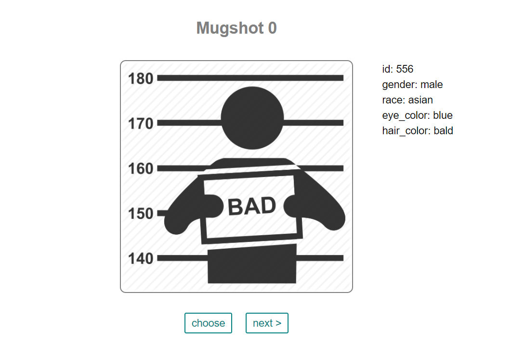

# Eye Witness
<p align="center"><a href="http://159.89.136.195:8886/">
</a></p>

## Overview

This prototype app attempts to objectify eyewitness identification by 
 randomizing the lineup using identities with similar physical characteristics 
to the suspect.  Similar suspect identities are pulled from a randomly generated database using textual characteristics in place of real photo identities for prototyping.

## Eyewitness Problem

“Eyewitness misidentification is the greatest contributing factor to wrongful convictions proven by DNA testing, playing a role in more than 70% of convictions overturned through DNA testing nationwide...Research illustrates that the human mind is not like a tape recorder; we neither record events exactly as we see them, nor recall them like a tape that has been rewound. In eyewitness identifications, witness memory is impacted by a variety of factors that occur from the time of the crime onwards, and their memories can be easily contaminated.” -The Innocence Project

## Link to Assignment

[Eye-Witness](http://159.89.136.195:8886/)

## Example
*Building a suspect lineup finds identifications with similar suspect features from which the witness must choose the actual suspect*

<p align="center"></p>

## Setup

### MySQL

```sh
$ mysql -u $username -p
mysql> CREATE USER 'student'@'localhost' IDENTIFIED BY 'password';
mysql> CREATE DATABASE 'mugshots';
mysql> GRANT PRIVILEGES ON mugshots.* to 'student'@'localhost';
```

### Node.js

```sh
npm install
node server.js
```

### Testing

```sh
sudo npm -g mocha
cd /test
mocha itests.js
mocha utests.js
```

## Improvements
- Iterate next step of prototyping using database with real identities
- Objectively match the suspect's physical characteristics using automated facial recognition

## Credits
- Casey Sanders
- Cheryl See
- Chris Kirchner 
- Michael Peters 
- Connor Pacala 
